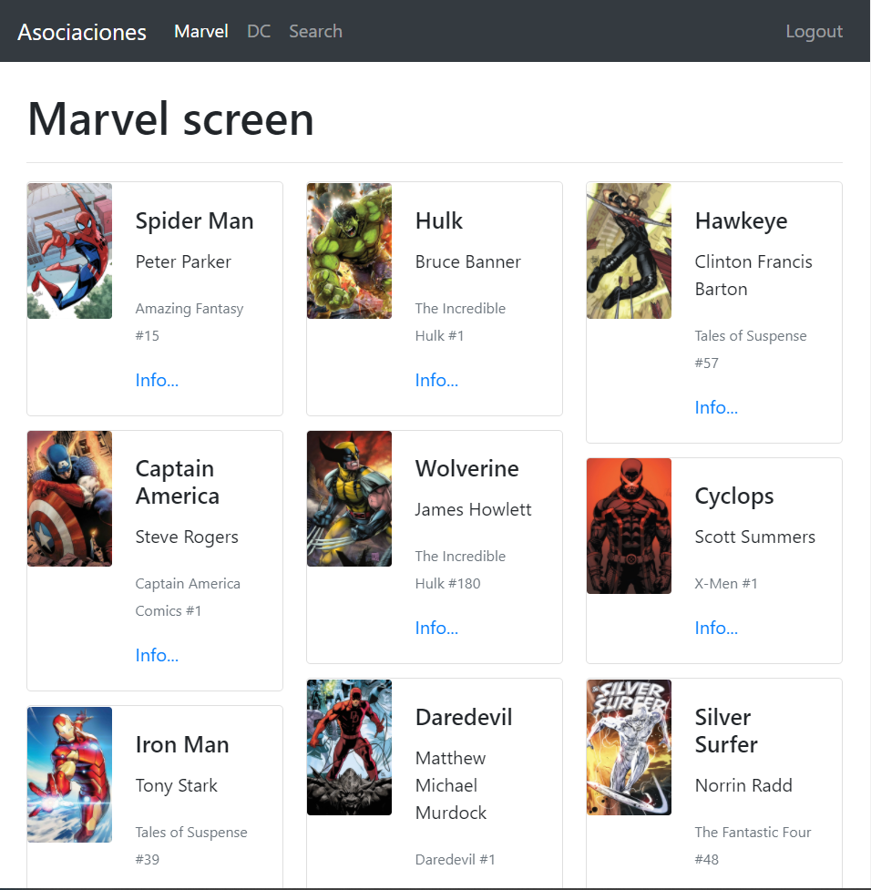
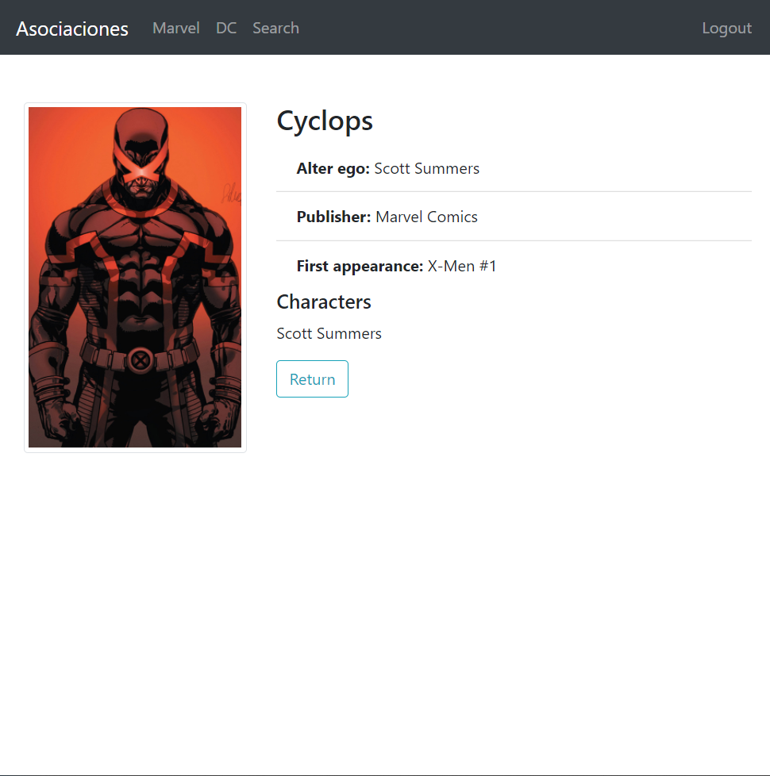

# Heroes App

This a repo with simulate heroes data, that show in heroes card, easly can be connecting app with data from a api 

Snaps:
1. Dashboard:

  

2. Hero card info:

  

rm: ``` npm install ```

This examples are part from the [react: De cero a Experto (Hooks y MERN) course](https://www.udemy.com/course/react-cero-experto)


